# Art of April

### Index
[2D Artwork](#2d-artwork)

  [2019](#2d-2019)

  [2020](#2d-2020)
  
  [2021](#2d-2021)
  
  [2022](#2d-2022)
  
  [2023](#2d-2023)
  
[3D Artwork](#3d-artwork)

  [2020]
  
  [2021]
  
  [2022]
  
  [2023]

## 2D Artwork

  [2019](#2d-2019) | [2020](#2d-2020) | [2021](#2d-2021) | [2022](#2d-2022) | [2023](#2d-2023)

### 2D 2019

  

Novemeber 9, 2019 | Digital

One of my first digital drawings

---

### 2D 2020

June 30, 2020 | Digital

First original character (that I care about)

---

July 23, 2020 | Pencil on Paper

One of my all time favorites

---

September 17, 2020 | Pencil on Paper

For my school's art class

---

October 12, 2020 | Digital

Halloween! Spooky Month~

---

### 2D 2021

January 11, 2021 | Digital

Inspired by that one vase of fake blue flowers my mom bought

---

January 16, 2021 | Digital

I like this one. I had it as my computer background for a while.

---

March 3, 2021 | Digital

I finally attempted to draw a nice background after watching a tutorial. Very fun.

---

March 10, 2021 | Digital

Redrawing of the
<a href="#original purple mermaid"> original purple mermaid</a>

---

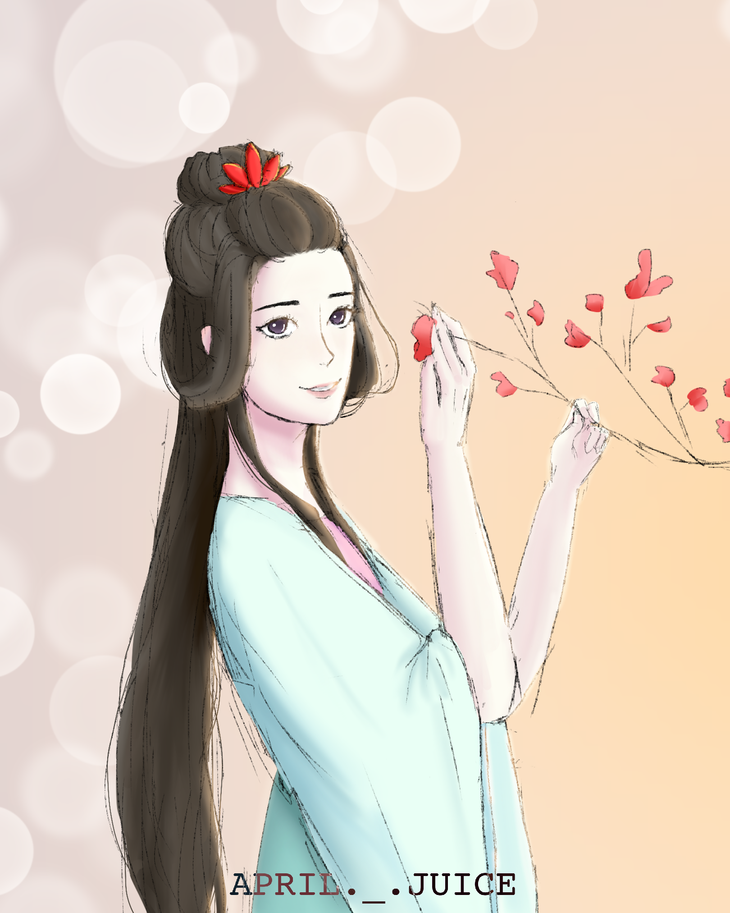

April 4, 2021 | Digital

Redrawing of my first drawing on Procreate Pocket

---

June 17, 2021 | Digital

Imagine roleplaying in Minecraft (I could never).

---

![Image of George Washington sweater]

December 16, 2021 | Print and Color Pencil on Paper

George Washington 😍

---

### 2D 2022

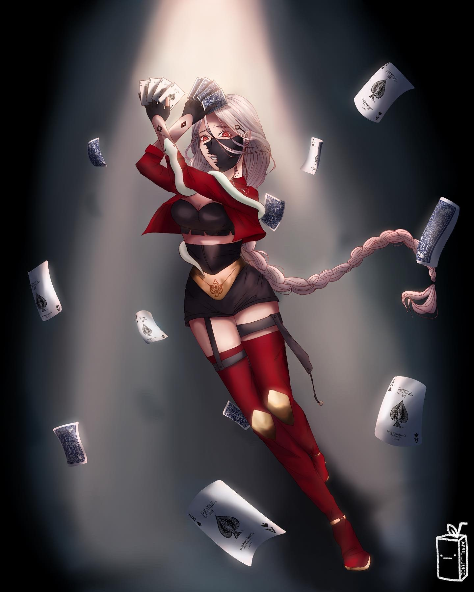

January 22, 2022 | Digital

Composition so slay. Last drawing on my old iPad mini 🥺

---

January 31, 2022 | Digital

Nancy Maria Donaldson Johnson (she made the ice cream machine) for history class

---

April 28, 2022 | Digital

Fanart for *Keeper of the Lost Cities* (nice book)

---

May 18, 2022 | Digital

Shalalala

---

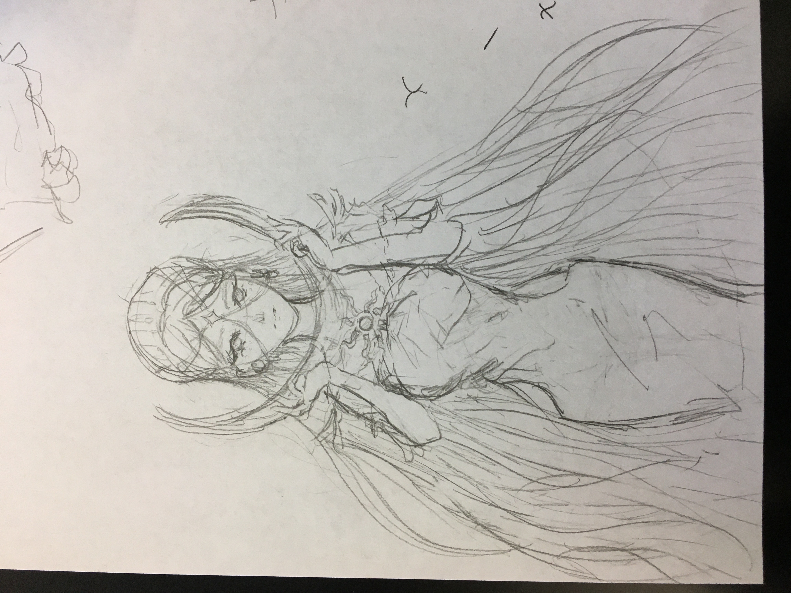

June 27, 2022 | Digital

I drew this after a test 🤯

---

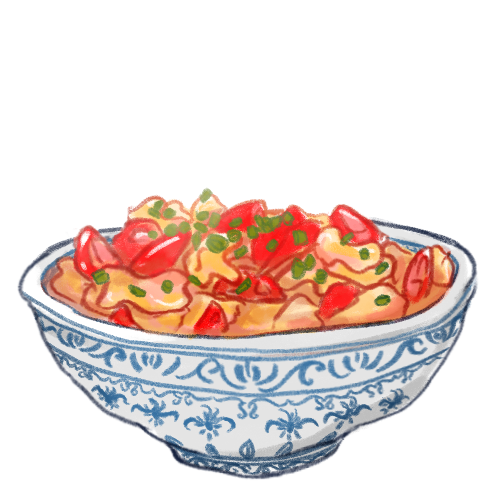

November 17, 2022 | Digital

For macromolecule cookbook assignment. I love 番茄炒蛋 (tomato and fried egg). Literally the yummiest thing ever 🤤🤤🤤😍😍

---

### 2D 2023

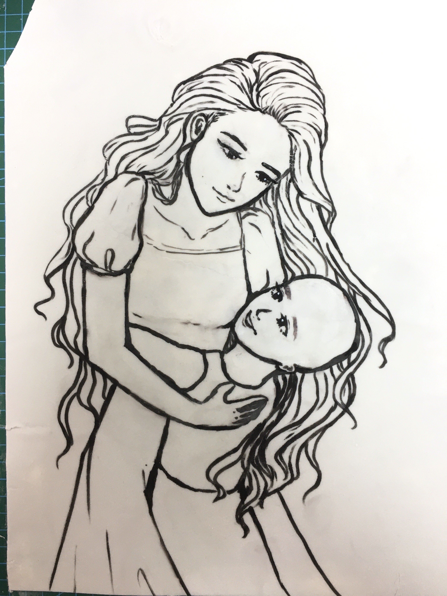

May 11, 2023 | Edible Marker on Fondant

Cake drawing for [Super Joey Foundation](https://superjoey.org/). 

---

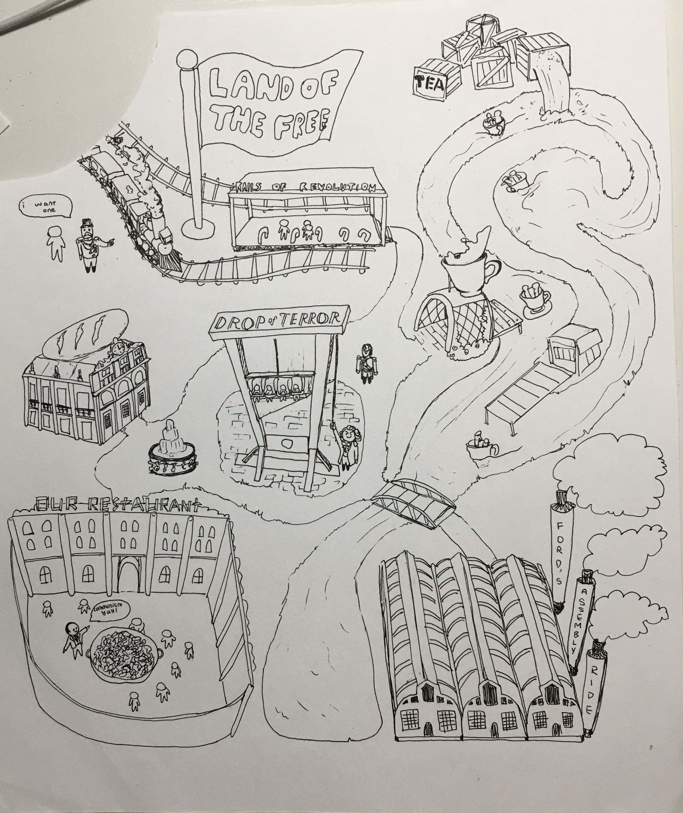

June 2, 2023 | Pen on Paper

AP World History reference???

---

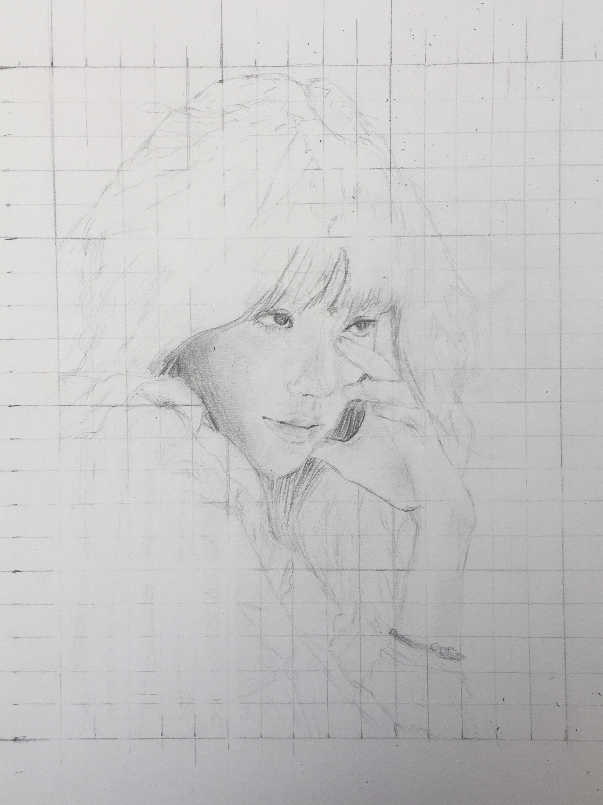

June 29, 2023 | Pencil on Paper

Tried grid drawing on people. One milimeter can make such a big difference in the vibe of the drawing 😖

---

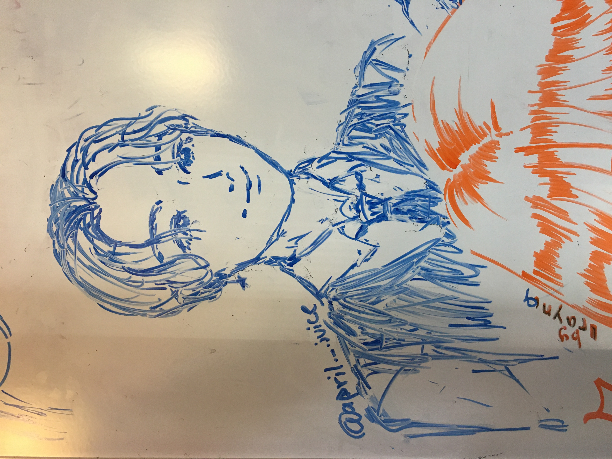

July 4, 2023 | Whiteboard Marker on Whiteboard

I don't know who, but someone erased half of the face 😿

---

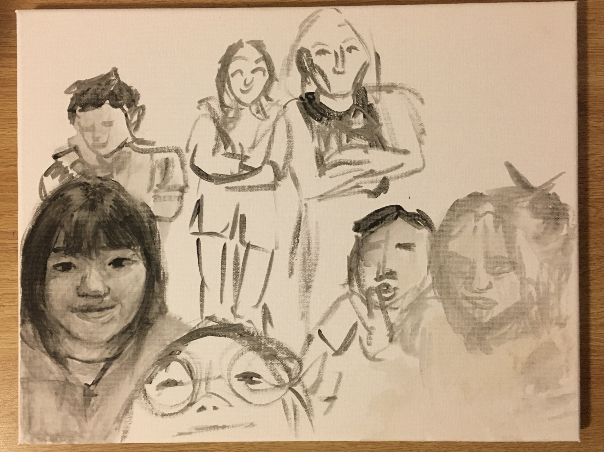

July 20, 2023 | Really Bad Paint on Canvas

Unfinished group portrait. I swear it looks better than this. This is an older unfinished version, and it will look better. Someday.

---

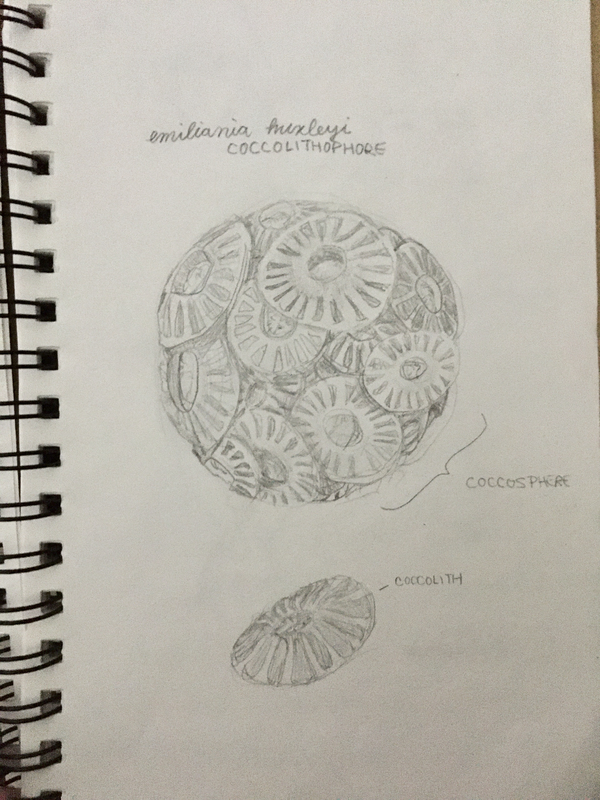

July 31, 2023 | Pencil on Paper

Coccolithophore and coccolith!!! My algae!!!

---

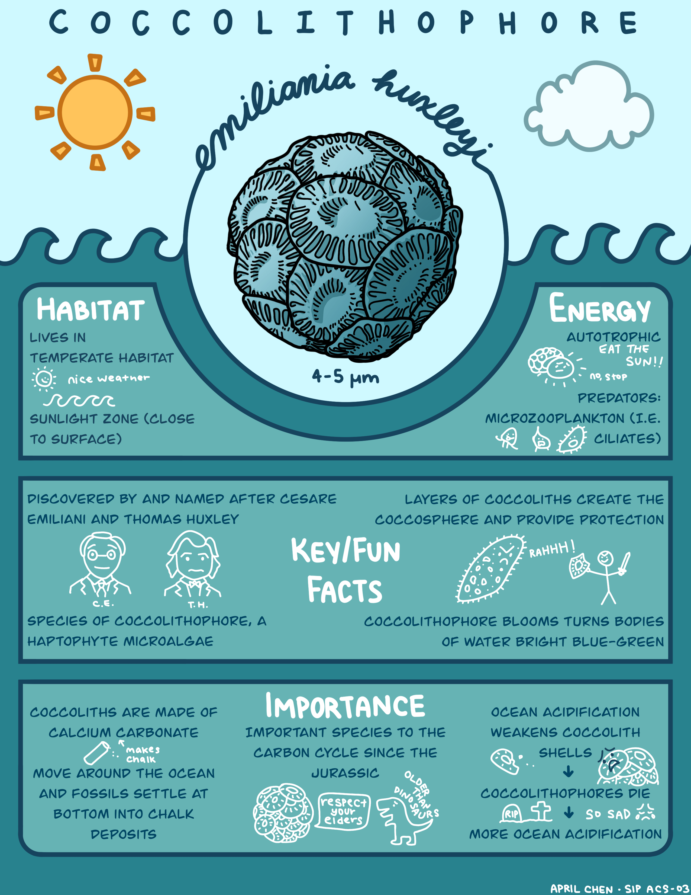

August 19, 2023 | Digital

My handdrawn, super cool poster for the coccolithophore, emiliania huxleyi.

---

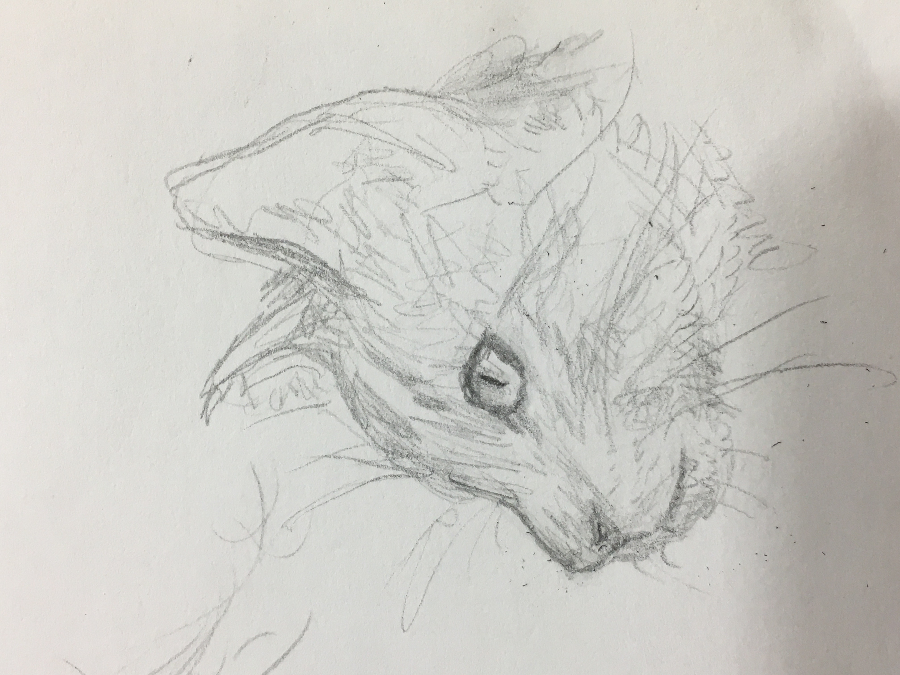

September 1, 2023 | Pencil on Paper

Meow

---

---

## 3D Artwork
